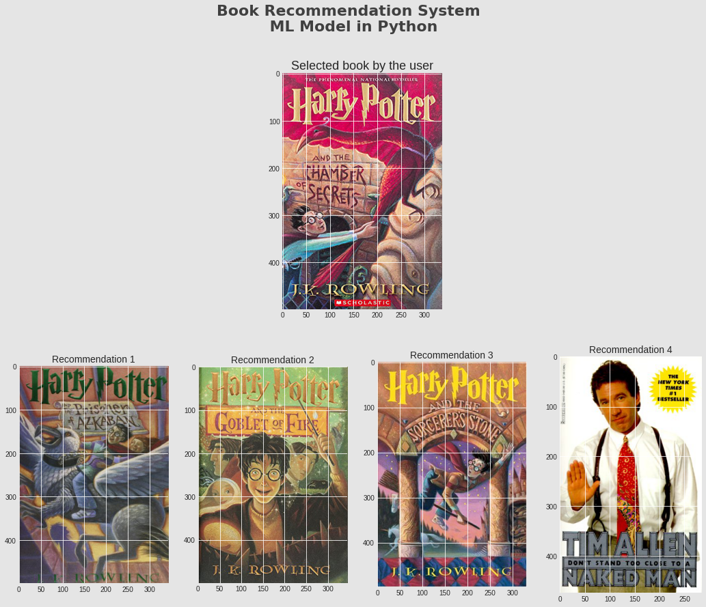

# Example of book recommendation

This is an example of book recommendation using NearestNeighbors.

Data can be found on [Kaggle](https://www.kaggle.com/datasets/arashnic/book-recommendation-dataset).

This is the final result. A user pick a book and the model recommend 4 books based on other user's choices and rating. 

